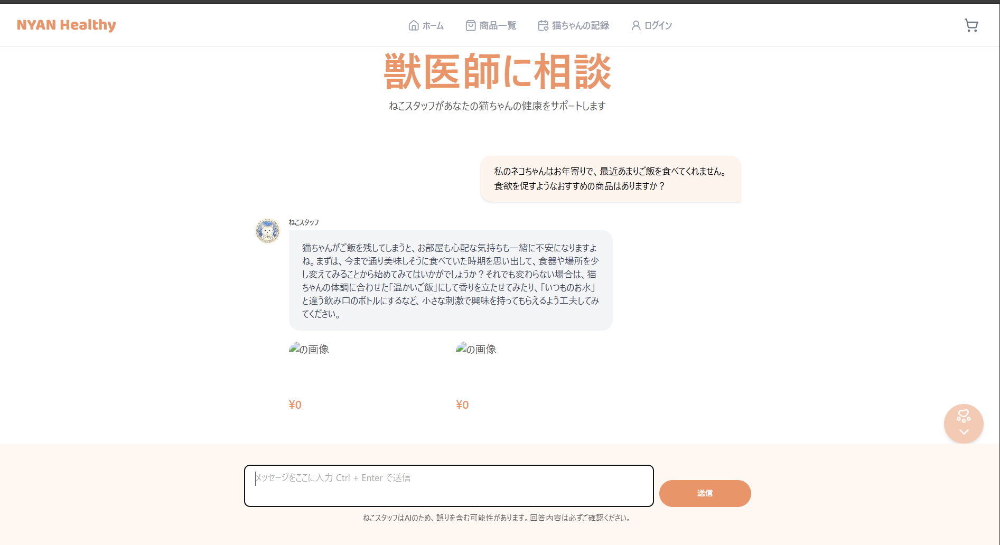
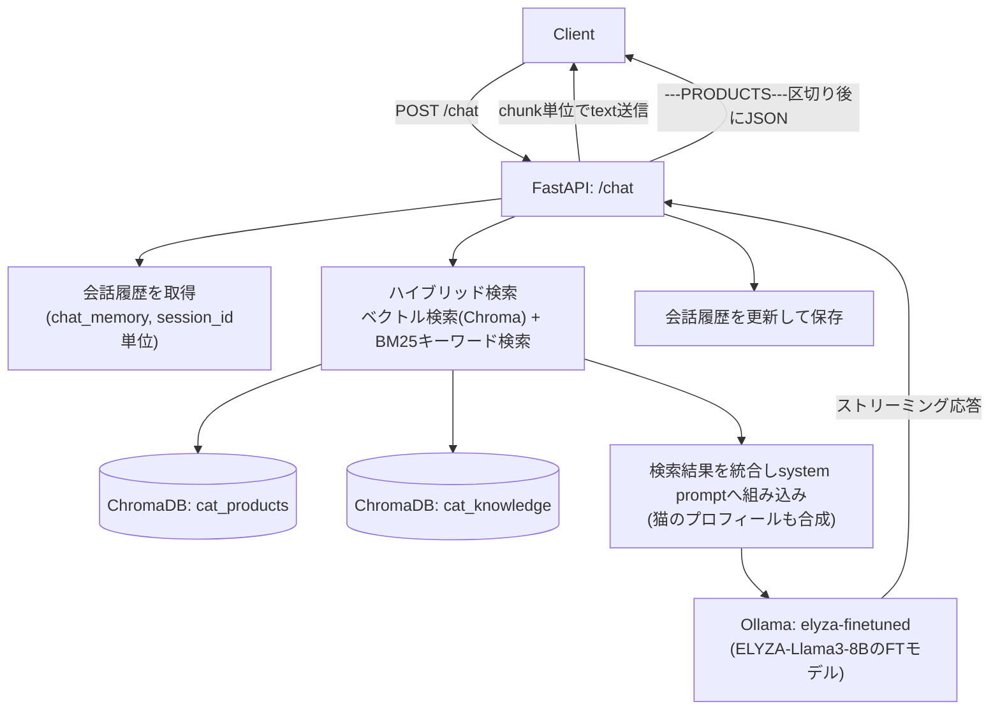

# Cat Concierge RAG Bot（ファインチューニング×ハイブリッドRAGによる猫の飼い主向けAIチャットボット）

## 概要
- 飼い猫のプロフィール（名前・年齢区分・性別）に寄り添いながら、猫の医療・お世話に関する専門知識と商品情報をもとに回答するAIチャットボットです。RAGで取得した情報を元にファインチューニング済みLLMが回答を生成し、ユーザーが「おすすめ」を求めたときだけ関連商品をレコメンドします。
- 汎用LLMのままでは「聞き上手なコンシェルジュ」としてのキャラクター性や口調を再現しづらかったこと、知識に対して責任逃れをするような発言があったこと、押し売りのような不快感があったため、独自データセットでファインチューニングしたモデルとRAGを組み合わせて作成しました。

## デモ


## アーキテクチャ



処理の流れ：ユーザーの発言 → セッションの会話履歴を取得 → 商品コレクション・ナレッジコレクションそれぞれに対してベクトル検索とBM25キーワード検索を実行しハイブリッドに統合 → 猫のプロフィールと検索結果をsystem promptに組み込み → Ollama上のファインチューニング済みモデルにストリーミングで問い合わせ → 回答をchunk単位でクライアントに返しつつ、区切り文字`---PRODUCTS---`の後に推奨商品のJSONを送信 → 会話履歴をセッションごとに直近10件保持して更新、という流れです。

また商品・ナレッジデータの登録は`/admin/products`・`/admin/knowledge`から行い、登録されたデータはChromaDBの各コレクションに保存されます。

## 技術スタックと選定理由
- **バックエンド**: FastAPI + Uvicorn — Swagger UI（`/docs`）で動作確認しやすく、`StreamingResponse`によるストリーミング実装も容易なため採用
- **LLM実行基盤**: Ollama — ローカル/コンテナ内でLLMとEmbeddingモデル（`mxbai-embed-large`）をホストし、API課金なしで繰り返し検証できる環境を構築
- **ファインチューニング済みモデル**: ELYZA-Llama3-JP-8Bを独自データセット（`FT_train_data.jsonl`）でファインチューニングし、GGUF形式に量子化してHugging Face（`ta-ku-mi/elyza-finetuned-gguf`）で公開、Ollamaのカスタムモデル（`elyza-finetuned`）として組み込み
- **ベクトルDB**: ChromaDB — 商品情報（`cat_products`）とナレッジ情報（`cat_knowledge`）を別コレクションで管理
- **検索方式（ハイブリッドRAG）**: ベクトル検索（Chromaの類似度スコア閾値検索）とBM25によるキーワード検索を組み合わせたハイブリッド検索を採用。ベクトル検索単体では「腎不全」のような専門用語や商品名の完全一致が必要なクエリで再現率が落ちるケースがあり、BM25による字面一致の検索を組み合わせることで検索精度を補強しています。
- **コンテナ化**: Docker Compose — FastAPIコンテナとOllamaコンテナを分離し、モデルデータは名前付きボリュームで永続化することで再現性のある環境を構築

## 工夫した点・苦労した点
- **検索精度の改善**: ベクトル検索単体では類似度スコアの閾値（`score_threshold`）を調整しても専門用語の検索漏れが解消しなかったため、BM25によるキーワード検索を組み合わせたハイブリッド検索に落ち着きました。
- **ストリーミング応答のパース**: Ollamaからのストリームは改行区切りのNDJSONで返ってくるため、chunkがJSONの途中で分割されることがありました。受信データをバッファに貯めて改行ごとに1件ずつ`json.loads`するロジックにすることで、不完全なJSONによるパースエラーを回避しました。
- **商品レコメンドの出し分け**: 商品情報とナレッジ情報を同じsystem promptに含めると、ユーザーが求めていない場面でもLLMが商品を紹介してしまう問題がありました。ユーザーの発言に「おすすめ」「商品」といったキーワードが含まれる場合のみ、レスポンスに商品情報（`---PRODUCTS---`以降のJSON）を含める形に落ち着きました。

## セットアップ方法
```bash
# 1. clone
git clone git@github.com:yasaka-takumi/work-product-202604.git
cd work-product-202604

# 2. .env を作成（Hugging Faceのアクセストークンを設定）
cat <<'EOF' > .env
HUGGINGFACE_TOKEN=your_huggingface_token
EOF

# 3. ファインチューニング済みモデル（gguf）を取得し配置
pip install huggingface_hub python-dotenv
python download_model.py
# -> elyza-finetuned/ 配下に Llama-3-ELYZA-JP-8B.Q4_K_M.gguf が保存されます
# （手動で取得する場合は https://huggingface.co/ta-ku-mi/elyza-finetuned-gguf からダウンロードし、
#   同じく work-product-202604/elyza-finetuned/ に配置してください）

# 4. コンテナをビルド・起動（初回はモデル取得等でかなり時間がかかります）
docker compose up -d --build

# 5. Ollamaにモデルを登録（初回のみ。以降はollama_dataボリュームに保存され再取得不要）
docker compose exec ollama ollama create elyza-finetuned -f /root/models/Modelfile
docker compose exec ollama ollama pull mxbai-embed-large

# 確認: 以下で2つのモデルが表示されれば成功
docker compose exec ollama ollama list
```

### データ登録
1. ブラウザで `http://localhost:8000/docs` を開く
2. `sql/products.json` の中身をコピーし、`POST /admin/products` の Request body に貼り付けて Execute（201 Createdで成功）
3. `default_data/cat_knowledge.json` の中身をコピーし、`POST /admin/knowledge` の Request body に貼り付けて Execute（201 Createdで成功）

### 動作確認
- 通常の応答確認: `/docs` から `POST /chat` を実行
- ストリーミング確認（Swagger UIでは確認できないためターミナルから実行）:
```bash
curl -s -N -X POST http://localhost:8000/chat \
     -H "Content-Type: application/json" \
     -d '{
       "user_id": "test",
       "session_id": "test",
       "message": "こんにちは！簡単な自己紹介をして",
       "external_data": {}
     }'
```
